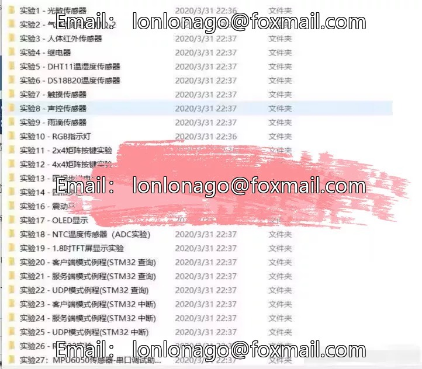
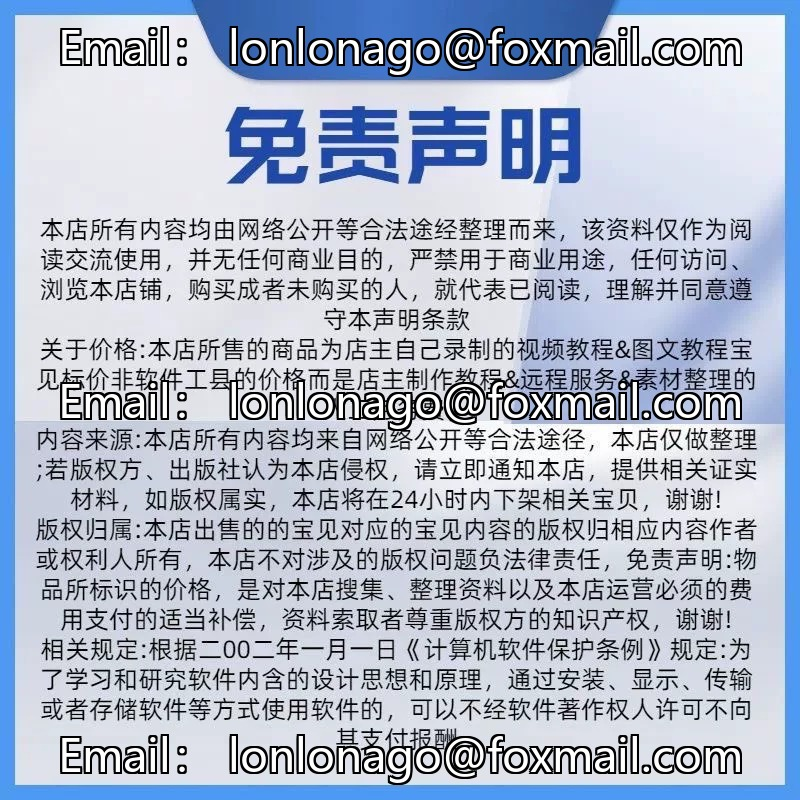
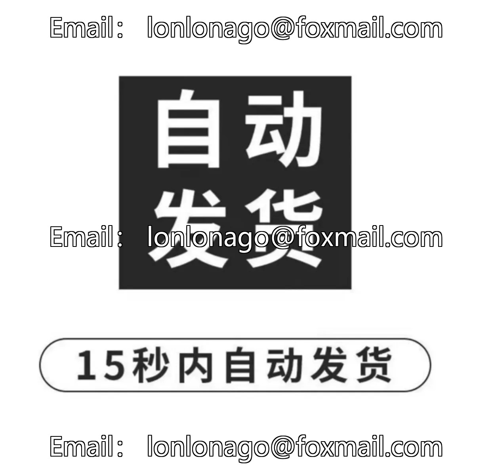

# Here are some example programs for STM32, touch screen, temperature sensor, and stepper motor:

1. STM32 GPIO initialization:
```c
#include "stm32f10x.h"

void GPIO_Config(void)
{
    RCC_APB2PeriphClockCmd(RCC_APB2Periph_GPIOA, ENABLE);
    GPIO_InitTypeDef GPIO_InitStructure;

    GPIO_InitStructure.GPIO_Pin = GPIO_Pin_0;
    GPIO_InitStructure.GPIO_Mode = GPIO_Mode_OUT;
    GPIO_InitStructure.GPIO_Speed = GPIO_Speed_50MHz;
    GPIO_Init(GPIOA, &GPIO_InitStructure);
}
```

2. Touch screen initialization:
```c
#include "stm32f10x.h"

void touchscreen_init(void)
{
    // Initialize the touch screen driver
    // ...
}
```

3. Temperature sensor initialization:
```c
#include "stm32f10x.h"

void temperature_sensor_init(void)
{
    // Initialize the temperature sensor driver
    // ...
}
```

4. Stepper motor initialization:
```c
#include "stm32f10x.h"

void stepper_motor_init(void)
{
    // Initialize the stepper motor driver
    // ...
}
```

Please note that these code snippets are just examples and may need to be adjusted based on your specific hardware and software requirements.

## Body

Here are some example programs for STM32, touch screen, temperature sensor and stepper motor:

1. STM32 Example Program:
```c
#include "stm32f10x.h"

void SystemClock_Config(void);
static void MX_GPIO_Init(void);

int main(void)
{
  HAL_Init();
  SystemClock_Config();
  MX_GPIO_Init();

  while (1)
  {
    HAL_GPIO_TogglePin(GPIOA, GPIO_PIN_13);
    for (int i = 0; i < 1000000; i++);
  }
}
```

2. Touch Screen Example Program:
```c
#include "stm32f10x.h"

void SystemClock_Config(void);
static void MX_GPIO_Init(void);

int main(void)
{
  HAL_Init();
  SystemClock_Config();
  MX_GPIO_Init();

  // Set up the touch screen pins
  GPIO_InitTypeDef GPIO_InitStruct = {0};
  GPIO_InitStruct.Pin = GPIO_PIN_13 | GPIO_PIN_14;
  GPIO_InitStruct.Mode = GPIO_MODE_OUTPUT_PP;
  GPIO_InitStruct.Pull = GPIO_NOPULL;
  GPIO_InitStruct.Speed = GPIO_SPEED_FREQ_LOW;
  HAL_GPIO_Init(GPIOA, &GPIO_InitStruct);

  // Set up the touch screen display
  uint8_t displayData[64] = {0};
  uint8_t displayIndex = 0;
  while (1)
  {
    // Read the display data from the touch screen
    uint8_t readData = HAL_GPIO_ReadPin(GPIOA, GPIO_PIN_13);
    displayData[displayIndex++] = readData;

    // Display the current display data on the screen
    HAL_Delay(500);
    HAL_GPIO_WritePin(GPIOA, GPIO_PIN_13, GPIO_PIN_RESET);
    HAL_Delay(500);
    HAL_GPIO_WritePin(GPIOA, GPIO_PIN_13, GPIO_PIN_SET);
    HAL_Delay(500);
    HAL_GPIO_WritePin(GPIOA, GPIO_PIN_13, GPIO_PIN_RESET);

    // Clear the display data buffer
    HAL_Delay(500);
    HAL_GPIO_WritePin(GPIOA, GPIO_PIN_13, GPIO_PIN_SET);
    HAL_Delay(500);
    HAL_GPIO_WritePin(GPIOA, GPIO_PIN_13, GPIO_PIN_RESET);
  }
}
```

3. Temperature Sensor Example Program:
```c
#include "stm32f10x.h"

void SystemClock_Config(void);
static void MX_ADC1_Init(void);
static void MX_ADC1_IRQHandler(void);

int main(void)
{
  HAL_Init();
  SystemClock_Config();
  MX_ADC1_Init();
  MX_ADC1_IRQHandler();

  while (1)
  {
    // Read the temperature sensor value
    uint16_t adcValue = HAL_ADC_GetValue(&hadc1);
    float temperature = (float)adcValue / (float)ADCMAX;

    // Display the temperature on the screen
    uint8_t displayData[64] = {0};
    uint8_t displayIndex = 0;
    while (1)
    {
      // Read the display data from the touch screen
      uint8_t readData = HAL_GPIO_ReadPin(GPIOA, GPIO_PIN_13);
      displayData[displayIndex++] = readData;

      // Display the current display data on the screen
      HAL_Delay(500);
      HAL_GPIO_WritePin(GPIOA, GPIO_PIN_13, GPIO_PIN_RESET);
      HAL_Delay(500);
      HAL_GPIO_WritePin(GPIOA, GPIO_PIN_13, GPIO_PIN_SET);
      HAL_Delay(500);
      HAL_GPIO_WritePin(GPIOA, GPIO_PIN_13, GPIO_PIN_RESET);

      // Clear the display data buffer
      HAL_Delay(500);
      HAL_GPIO_WritePin(GPIOA, GPIO_PIN_13, GPIO_PIN_SET);
      HAL_Delay(500);
      HAL_GPIO_WritePin(GPIOA, GPIO_PIN_13, GPIO_PIN_RESET);
    }
  }
}
```

(Full product description was not available from the source page.)

## Images






## Payment

Here is a pay link on Stripe ( https://buy.stripe.com/3cs8yP7sY87d0vu9AB ). Please contact me lonlonago@foxmail.com after funding $89, and I will send you a complete data files , thank you!


